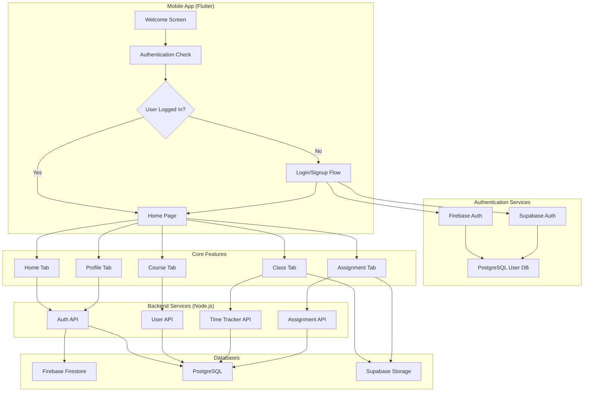
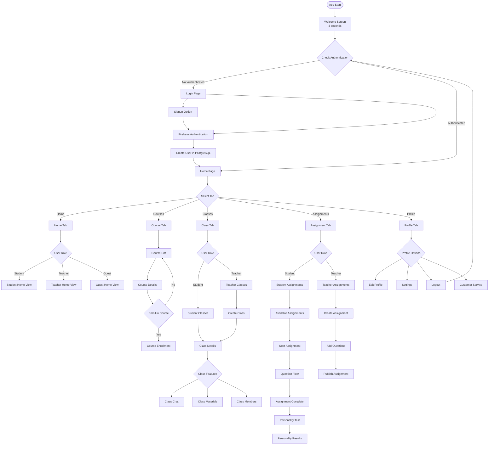
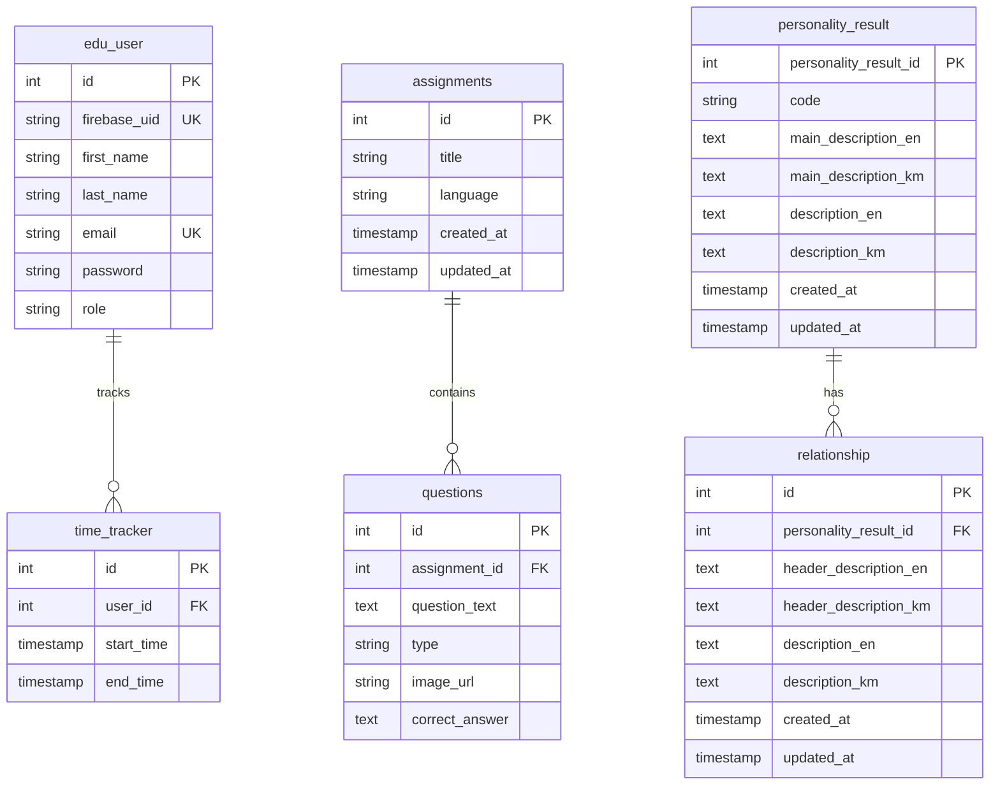
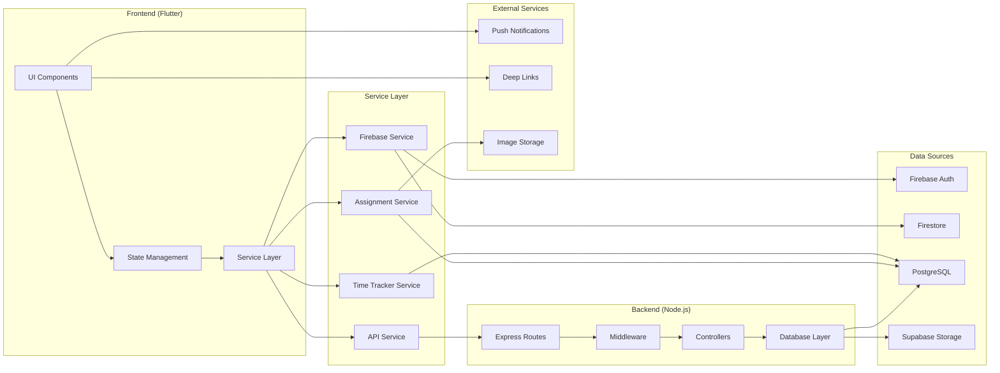
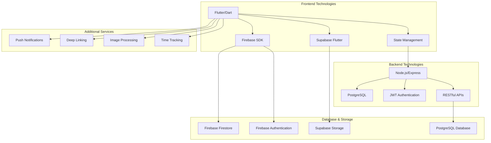

# EduHub App Flowchart

## App Architecture Overview

## Detailed User Flow

## Database Schema Flow

## Data Flow Architecture

## Key Features Flow

```mermaid
graph TB
    subgraph "Authentication Flow"
        A1[Email/Password Login] --> A2[Firebase Auth]
        A3[Google Sign-in] --> A2
        A4[Signup] --> A5[Create User in PostgreSQL]
        A2 --> A6[JWT Token]
        A5 --> A6
        A6 --> A7[Store in SharedPreferences]
    end
    
    subgraph "Time Tracking Flow"
        B1[App Open] --> B2[Start Time Tracking]
        B2 --> B3[Record Start Time]
        B4[App Close/Background] --> B5[End Time Tracking]
        B5 --> B6[Calculate Duration]
        B6 --> B7[Store in PostgreSQL]
    end
    
    subgraph "Assignment Flow"
        C1[Select Assignment] --> C2[Load Questions]
        C2 --> C3[Display Questions]
        C3 --> C4[Record Answers]
        C4 --> C5[Calculate Score]
        C5 --> C6[Personality Analysis]
        C6 --> C7[Show Results]
    end
    
    subgraph "Class Communication Flow"
        D1[Send Message] --> D2[Upload to Supabase Storage]
        D2 --> D3[Store Metadata in Firestore]
        D3 --> D4[Send Push Notification]
        D4 --> D5[Update Chat UI]
    end
```

## Technology Stack Integration

This flowchart illustrates the complete EduHub app architecture including:

1. **User Authentication Flow** - From welcome screen to authenticated home page
2. **Role-Based Navigation** - Different flows for students, teachers, and guests
3. **Feature Navigation** - Core tabs and their sub-features
4. **Database Architecture** - PostgreSQL schema with relationships
5. **Data Flow** - How data moves between frontend, backend, and databases
6. **Technology Integration** - How different services work together

The app uses a hybrid approach with Firebase for authentication and some real-time features, PostgreSQL for structured data, and Supabase for file storage and additional backend services.
